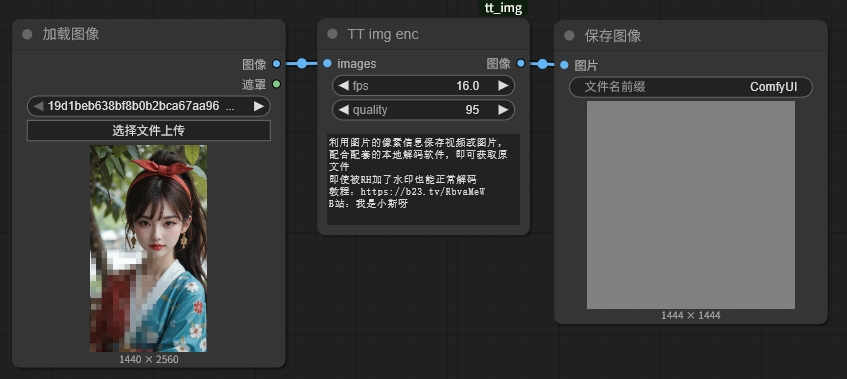
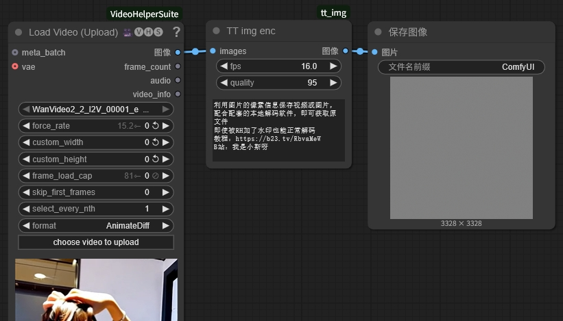
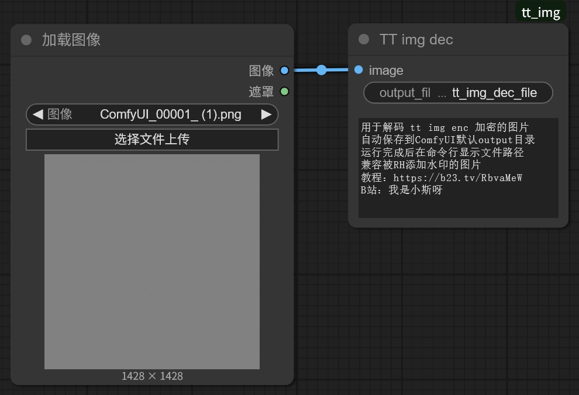

# 🎭 TT img - 图片视频破限加密comfyui节点

> 🚀 **突破RH平台审查限制，让文件传输更安全！**

## ✨ 主要功能

🎯 **核心特性**：Comfyui中将视频、图片等文件隐藏到普通图片的像素信息中，实现文件加密。本地可通过exe解码，无需comfyui环境及，CPU即可快速解码

🛡️ **安全优势**：
- 🔒 **突破平台审查**：图片看起来完全正常，不受平台安全审查影响
- 💧 **水印兼容**：即使图片被平台添加水印，也能正常解码提取原文件
- 🎨 **视觉伪装**：生成的图片与普通图片无异，不会引起怀疑
- 📱 **跨平台支持**：windows下可使用exe直接解码，其他平台可用comfyui解码节点解码

## 🏗️ 系统架构

TT img 是一个完整的图片视频隐藏comfyui插件，包含编码和解码两个核心组件：

### 🔐 TT img enc（编码节点）
1. **智能格式转换**：
   - 📸 视频序列 → 自动转换为 MP4 视频
   - 🖼️ 输入单张图片 → 自动转换为 JPG 格式

2. **噪点图片生成**：创建带有随机噪点的图片，完美伪装

3. **文件嵌入**：将转换后的文件（MP4/JPG）嵌入到造点图片中

### 🔓 TT img dec（解码节点）
1. **文件提取**：从噪点图片中提取隐藏的文件（MP4/JPG等）
2. **自动识别**：自动识别文件类型和扩展名
3. **智能解码**：智能提取数据
4. **静默运行**：完美还原原始文件

## 🚀 安装方法

### 🎯 方法1：Git Clone（推荐）
```bash
cd ComfyUI/custom_nodes
git clone https://github.com/liangtongt/TT-tools.git
```
然后重启 ComfyUI，节点会自动加载。

### 📥 方法2：手动下载
1. 下载项目文件
2. 将整个项目文件夹复制到 ComfyUI 的 `custom_nodes` 目录
3. 重启 ComfyUI


## 💻 独立解码工具

即使没有 ComfyUI 环境，你也可以使用独立的解码工具：

### 🖥️ Windows 用户
直接运行 `tt_img_dec.exe`，无需安装任何环境！

### 🐍 Python 用户
```bash
python extract_zip.py <图片路径>
```

### 📱 跨平台支持
- ✅ Windows: `tt_img_dec.exe`
- ✅ macOS/Linux: `tt_img_dec_loc.py`
- ✅ 所有平台: ComfyUI 节点

## 📖 使用方法

### 🔐 TT img enc（编码节点）

#### 节点参数
- **images**: 输入的图片（支持多张）
- **fps**: 视频帧率（1-60，默认30）
- **quality**: JPG 质量（1-100，默认95）

#### 工作流程
1. 连接图片输入到 `images` 端口
2. 调整其他参数（可选）
3. 运行工作流
4. 下载输出的造点图片

### 🔓 TT img dec（解码节点）

#### 节点参数
- **image**: 包含隐藏文件的造点图片
- **output_filename**: 输出文件名（可选，默认为 "extracted_file"）

#### 工作流程
1. 连接造点图片到 `image` 端口
2. 设置输出文件名（可选）
3. 运行工作流
4. 提取的文件自动保存在ComfyUI的 `output/` 目录下
5. 自动重命名避免文件覆盖

### 完整工作流示例

**编码工作流**：
```
Load Image → TT img enc → Save Image
```
图片编码


视频编码



**解码工作流**：
```
Load Image → TT img dec → Preview Text
```
解码


**完整循环**：
```
Load Image → TT img enc → Save Image → Load Image → TT img dec → Preview Text
```

### 📁 文件提取

**🚀 方法1：使用tt_img_dec.exe（推荐）**
- 直接将加密好的图片拖动到exe上即可自动解码

**🎯 方法2：使用ComfyUI解码节点**
- 直接在ComfyUI中使用 `TT img dec` 节点
- 自动识别文件类型和扩展名
- 静默运行，无任何输出干扰

**🐍 方法3：使用Python脚本**
```bash
python tt_img_dec_loc.py <图片路径>
```

**📂 方法4：指定输出路径**
```bash
python tt_img_dec_loc.py <图片路径> <输出文件路径>
```

**💡 示例：**
```bash
python tt_img_dec_loc.py output_image.png
python tt_img_dec_loc.py output_image.png my_video.mp4
python tt_img_dec_loc.py output_image.png my_image.jpg
```

## 🔬 技术原理

### 🎬 图片转视频
- 使用将多张图片合成为 MP4 视频
- 支持自定义帧率
- 自动处理 RGB/BGR 颜色空间转换

### 🖼️ 图片转 JPG
- 使用将图片转换为高质量 JPG 格式
- 支持自定义质量参数

### 🔐 文件嵌入
- 利用图片的像素信息写入文件内容
- 直接嵌入原始文件数据
- 保持文件扩展名信息
- 支持任意大小的文件（文件越大，生成的图片越大）

### 💾 存储图片
- 纯色背景（灰色，128值）
- 专为存储效率优化
- 动态图片尺寸（最小64x64，无上限）
- 根据文件大小自动调整

### 🛡️ 水印兼容性
- 目前兼容RH自动添加的水印
- 支持多种图片格式转换后信息不丢失

## ⚠️ 注意事项

1. **📏 图片尺寸**：输出图片尺寸根据文件大小动态调整（最小64x64，无上限）
2. **🖼️ 输出数量**：无论输入多少张图片，都只输出一张存储图片
3. **💾 文件大小限制**：无限制，根据文件大小自动调整图片尺寸
4. **🗂️ 临时文件**：处理过程中会创建临时文件，完成后自动清理
5. **❌ 错误处理**：如果处理失败，会输出错误提示图片
6. **🔓 文件提取**：必须使用提供的提取工具，不能直接改后缀名
7. **💧 水印兼容**：支持平台水印，自动跳过水印区域
8. **📱 格式支持**：支持RGB和RGBA格式图片

## 📋 示例工作流

### 🔐 编码工作流
```
Load Image → TT img enc → Save Image
```


### 🔓 解码工作流
```
Load Image → TT img dec → Preview Text
```

### 🔄 完整循环工作流
```
Load Image → TT img enc → Save Image → Load Image → TT img dec → Preview Text
```

参考 `examples/` 目录下的工作流文件：
- 📁 `basic_workflow.json`: 基本编码工作流
- 🎬 `video_workflow.json`: 视频编码工作流  
- 🔓 `decode_workflow.json`: 解码工作流

## 🔧 故障排除

### ❓ 常见问题

1. **📦 依赖缺失**：确保安装了所有必需的 Python 包
2. **💾 内存不足**：处理大量图片时可能需要更多内存
3. **🔐 文件权限**：确保 ComfyUI 有权限创建临时目录
4. **⚡ torch兼容性**：确保ComfyUI环境中有torch支持

### ⚠️ 常见错误

- **OpenCV error: src is not a numpy array**：这通常意味着输入格式问题，v1.0.2已修复
- **'numpy.ndarray' object has no attribute 'cpu'**：这通常意味着torch未正确安装或版本不兼容
- **ImportError: No module named 'cv2'**：需要安装opencv-python
- **ImportError: No module named 'PIL'**：需要安装Pillow

### 💡 错误信息

- 检查 ComfyUI 控制台的错误输出
- 验证输入图片格式是否正确
- 确认输出目录有写入权限
- 如果遇到RGBA格式问题，确保使用最新版本

## 📝 更新日志

### 🆕 v2.0.0 - 新增解码节点
- ✅ 新增 `TT img dec` 解码节点
- ✅ 基于 `extract_zip.py` 的成功解码逻辑
- ✅ 支持ComfyUI节点接口
- ✅ 静默运行，无任何输出干扰
- ✅ 自动文件类型识别
- ✅ 自动重命名避免文件覆盖

### 🔧 v1.0.8 - 编码节点优化
- 🚀 移除噪点设置，优化存储效率，最小图片尺寸降至64x64
- 📏 移除图片尺寸上限限制，支持任意大小文件
- 💾 实现动态图片尺寸，支持大文件存储（如865KB MP4）
- 🔓 移除ZIP压缩，直接存储原始文件，提高存储效率
- 🛠️ 修复ZIP提取问题，提供专用提取工具，确保数据完整性
- 📈 修复存储容量问题，支持大文件（如21帧视频），动态图片尺寸
- ⚡ 修复torch张量输入处理问题，自动转换ComfyUI输入格式
- 🔧 修复torch兼容性和输出格式问题，确保只输出一张图片
- 🎯 初始版本，支持基本的图片转视频/图片功能

### 🌟 最新特性
- 💧 **水印兼容性**：支持平台水印，自动跳过水印区域
- 📱 **RGBA支持**：支持4通道PNG图片自动转换
- 🔇 **静默运行**：解码节点无任何输出，专注用户体验
- 🔄 **自动重命名**：智能处理文件名冲突，避免覆盖

## 🎯 总结

TT img 是一个功能强大的图片隐写工具套件，专为突破平台审查限制而设计：

### 🔒 **核心优势**
- 🚫 **突破审查**：图片看起来完全正常，不受平台安全审查影响
- 💧 **水印兼容**：即使被平台添加水印，也能正常解码
- 🎨 **完美伪装**：生成的图片与普通图片无异
- 📱 **跨平台支持**：支持各种图片格式和平台

### 🛠️ **使用方式**
- 🎮 **ComfyUI用户**：使用编码/解码节点，完整工作流支持
- 🖥️ **Windows用户**：直接运行 `tt_img_dec.exe`，无需安装环境
- 🐍 **开发者**：使用Python脚本，灵活定制
- 📱 **所有用户**：支持RGB/RGBA格式，自动处理各种情况

### 🚀 **应用场景**
- 📤 **文件传输**：安全传输敏感文件
- 🎬 **视频分享**：隐蔽分享视频内容
- 🖼️ **图片传输**：安全传输图片文件
- 🔐 **数据保护**：保护重要数据不被审查

**让文件传输更安全，让创意表达更自由！** 🎉
