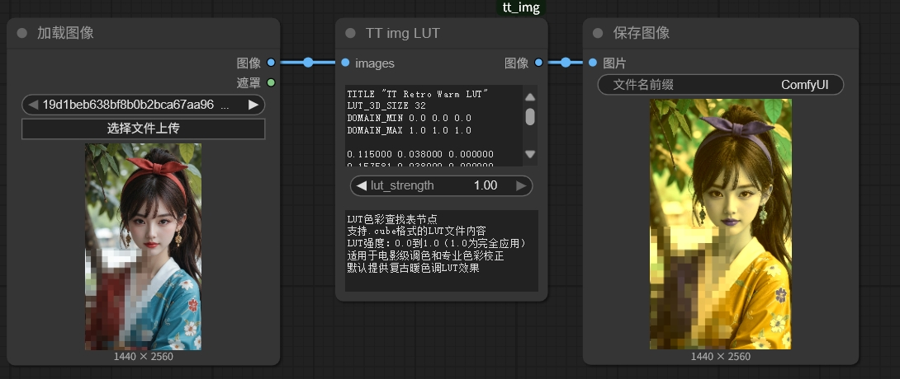
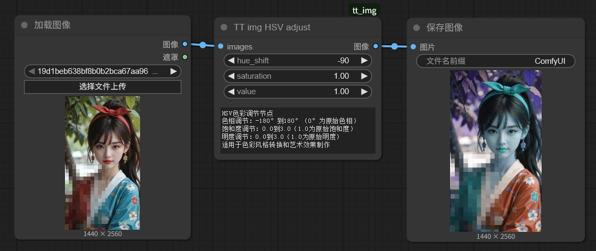
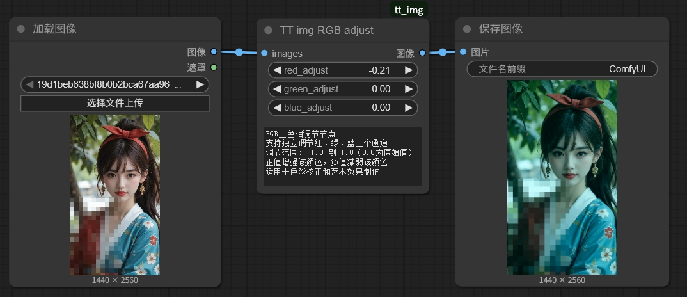
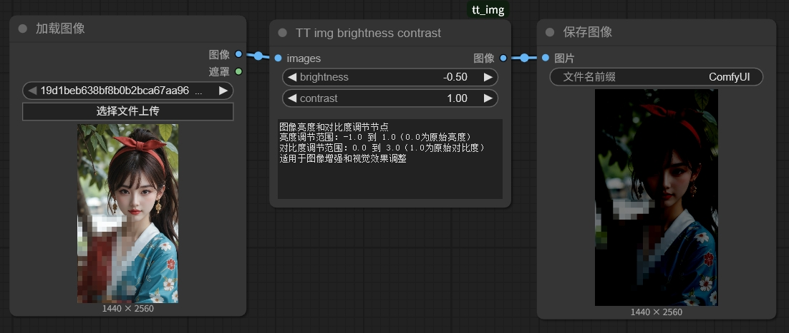
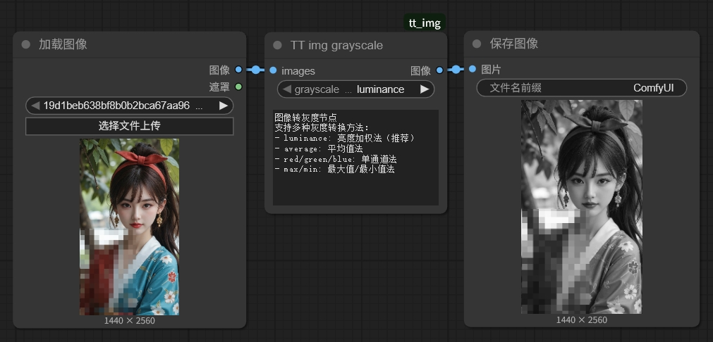
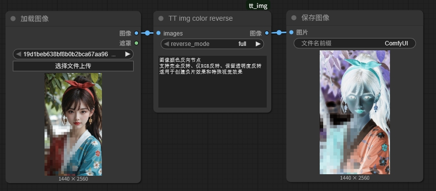
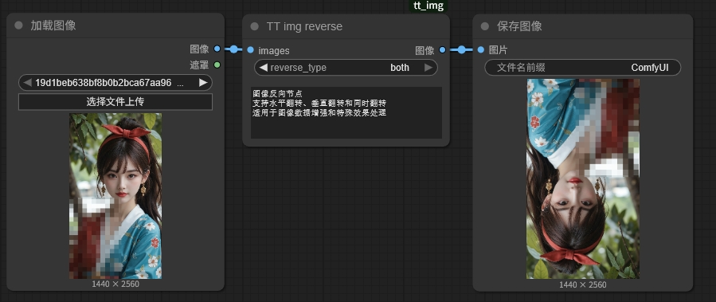

# 🎨 TT Tools - ComfyUI 最常用的图像处理工具套件

> 🚀 **强大的图像处理工具集，包含专业调色、特效处理和文件加密功能！**

## ✨ 主要功能

TT Tools 是一个功能丰富的 ComfyUI 节点套件，提供专业的图像处理、色彩调节功能。

## 更新说明
2025.10.16 支持多文件打包，图片数量大于1小于10时会以多个图片打包。尝试解决seedvr2的兼容性问题，和部分音频插件的兼容性问题。

2025.10.6 新加入tt img enc V2彩图加密版本，存储性能提升50%，支持1分钟长视频，解码速度更快。配合微信小程序tttool进行毫秒级极速解码，10M以下秒解，80M大文件20+秒解开。

### 🎨 **图像处理功能**
- 🔄 **图像翻转**：支持水平、垂直和同时翻转
- 🎨 **颜色反转**：完全反转、RGB反转、保留透明度反转
- ⚫ **灰度转换**：多种灰度转换算法（亮度加权、平均值、单通道等）
- 🌟 **亮度对比度**：精确调节图像亮度和对比度
- 🎯 **RGB调节**：独立调节红、绿、蓝三个通道
- 🌈 **HSV调节**：专业色相、饱和度、明度调节
- 🎬 **LUT调色**：支持.cube格式LUT文件，电影级调色效果
- 🔒 **文件加密**：图片加密，让机密图片网络传输更安全


## 🎨 图像处理节点详解

### 1. 🎬 TT img LUT - LUT色彩查找表节点

支持.cube格式LUT文件，提供电影级调色效果。

**功能特点**：
- 支持.cube格式LUT文件内容直接输入
- 内置复古暖色调默认LUT
- LUT强度调节：0.0 到 1.0
- 三线性插值算法，确保平滑色彩过渡



### 2. 🌈 TT img HSV adjust - HSV色彩调节节点

专业的色相、饱和度、明度调节，适用于色彩风格转换和艺术效果制作。

**参数范围**：
- 色相：-180° 到 180°（0°为原始色相）
- 饱和度：0.0 到 3.0（1.0为原始饱和度）
- 明度：0.0 到 3.0（1.0为原始明度）



### 3. 🎯 TT img RGB adjust - RGB三色相调节节点

独立调节红、绿、蓝三个通道，适用于色彩校正和艺术效果制作。

**调节范围**：-1.0 到 1.0（0.0为原始值）



### 4. 🌟 TT img brightness contrast - 亮度对比度调节节点

精确调节图像亮度和对比度，适用于图像增强和视觉效果调整。

**参数范围**：
- 亮度：-1.0 到 1.0（0.0为原始亮度）
- 对比度：0.0 到 3.0（1.0为原始对比度）



### 5. ⚫ TT img grayscale - 灰度转换节点

支持多种专业的灰度转换方法。

**转换方法**：
- `luminance`：亮度加权法（ITU-R BT.709标准，推荐）
- `average`：平均值法
- `red/green/blue`：单通道法
- `max/min`：最大值/最小值法



### 6. 🎨 TT img color reverse - 颜色反转节点

创建负片效果和特殊视觉效果。

**反转模式**：
- `full`：完全反转（所有通道）
- `rgb_only`：仅RGB反转（保留透明度）
- `preserve_alpha`：保留透明度反转



### 7. 🔄 TT img reverse - 图像翻转节点

支持多种翻转模式，适用于图像数据增强和特殊效果处理。

**翻转类型**：
- `horizontal`：水平翻转（左右翻转）
- `vertical`：垂直翻转（上下翻转）
- `both`：同时进行水平和垂直翻转




### 8. 🔒 TT img enc V1/v2 - 图像加密节点

解决需要对生成的内容进行隐私保护时可以经行加密，因为平台需要长时间留存生成内容，可能泄露。

## 🚀 安装方法

### 🎯 方法1：Git Clone（推荐）
```bash
cd ComfyUI/custom_nodes
git clone https://github.com/liangtongt/TT-tools.git
```

### 📥 方法2：手动下载
1. 下载项目文件
2. 将整个项目文件夹复制到 ComfyUI 的 `custom_nodes` 目录
3. 重启 ComfyUI

## 📖 使用示例

### 🎨 图像处理工作流

**基础图像处理链**：
```
Load Image → TT img brightness contrast → TT img HSV adjust → TT img LUT → Save Image
```

**艺术效果处理链**：
```
Load Image → TT img RGB adjust → TT img color reverse → TT img grayscale → Save Image
```

**数据增强处理链**：
```
Load Image → TT img reverse → TT img brightness contrast → Save Image
```


## 🔬 技术原理

### 🎨 图像处理算法
- **三线性插值**：LUT节点使用高质量的三线性插值算法
- **HSV色彩空间**：专业的色彩调节算法
- **亮度加权**：ITU-R BT.709标准的灰度转换
- **通道独立调节**：精确的RGB通道控制


## 🔧 故障排除

### ❓ 常见问题

1. **📦 依赖缺失**：确保安装了所有必需的 Python 包
2. **💾 内存不足**：处理大量图片时可能需要更多内存
3. **🔐 文件权限**：确保 ComfyUI 有权限创建临时目录
4. **⚡ torch兼容性**：确保ComfyUI环境中有torch支持

### ⚠️ 常见错误

- **OpenCV error**：确保安装了opencv-python
- **ImportError: No module named 'PIL'**：需要安装Pillow
- **LUT格式错误**：确保.cube文件格式正确

## 📝 更新日志

### 🆕 v3.0.0 - 新增图像处理节点
- ✅ 新增 `TT img reverse` 图像翻转节点
- ✅ 新增 `TT img color reverse` 颜色反转节点
- ✅ 新增 `TT img grayscale` 灰度转换节点
- ✅ 新增 `TT img brightness contrast` 亮度对比度调节节点
- ✅ 新增 `TT img RGB adjust` RGB三色相调节节点
- ✅ 新增 `TT img HSV adjust` HSV色彩调节节点
- ✅ 新增 `TT img LUT` LUT色彩查找表节点
- ✅ 内置复古暖色调默认LUT
- ✅ 支持.cube格式LUT内容直接输入


### 🌟 最新特性
- 💧 **水印兼容性**：支持平台水印，自动跳过水印区域
- 📱 **RGBA支持**：支持4通道PNG图片自动转换
- 🎨 **专业调色**：LUT支持电影级调色效果
- 🔄 **批量处理**：所有节点支持批量图像处理

## 🎯 总结

TT Tools 是一个功能强大的 ComfyUI 图像处理工具套件：

### 🎨 **图像处理优势**
- 🔄 **多样化处理**：翻转、反转、灰度、亮度对比度等
- 🎯 **精确控制**：RGB、HSV独立调节
- 🎬 **专业调色**：LUT支持电影级调色
- ⚡ **高效处理**：批量处理，性能优化


### 🚀 **应用场景**
- 🎨 **图像处理**：专业调色、特效制作、数据增强
- 🔐 **文件传输**：安全传输敏感文件
- 🎬 **视频分享**：隐蔽分享视频内容
- 🖼️ **图片传输**：安全传输图片文件

**让图像处理更专业，让文件传输更安全！** 🎉